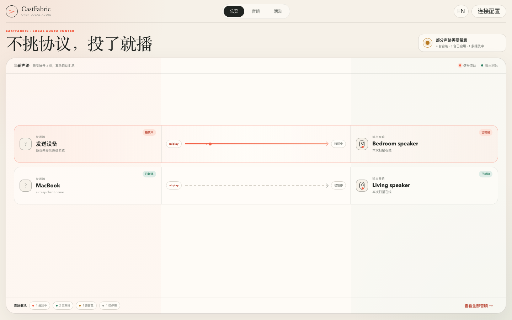
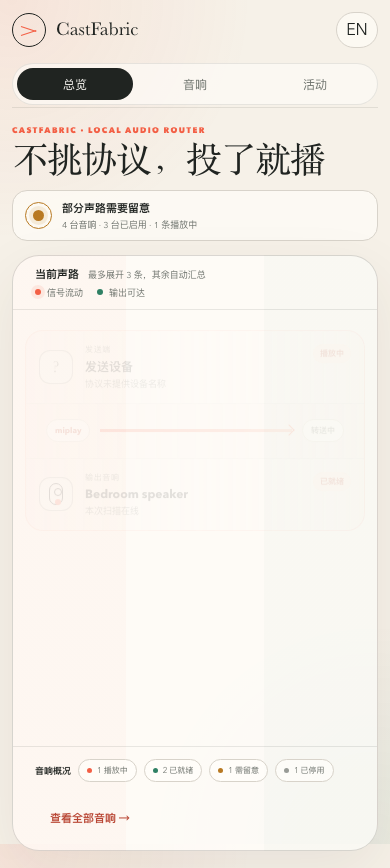

<p align="center"></p>
<h1 align="center">CastFabric</h1>
<p align="center"><strong>Cast it. It plays.</strong></p>
<p align="center">An open local-audio fabric: one independent DLNA, AirPlay and MiPlay receiver suite per speaker.</p>

<p align="center">
  <a href="https://github.com/wangerzi/CastFabric/actions/workflows/test.yml"></a>
  <a href="https://github.com/wangerzi/CastFabric/releases"></a>
  <a href="https://github.com/wangerzi/CastFabric/pkgs/container/castfabric"></a>
  <a href="LICENSE"></a>
</p>
<p align="center"><a href="README.md">简体中文</a> · English</p>



CastFabric receives DLNA, AirPlay and MiPlay audio from phones and computers, then routes it to
standard UPnP/DLNA MediaRenderers on your LAN. The standard path does not depend on a Xiaomi account.
Xiaomi cloud support remains only as an explicitly enabled compatibility extension.

Every enabled output gets its own `CastFabric · <speaker name>` receiver suite. Different speakers
can play concurrently, while protocols targeting the same speaker share an isolated session owner.
There is no global “default speaker” in the product model.

## Why CastFabric

- **Multiple inputs, one output model:** virtual DLNA, AirPlay and MiPlay all terminate at a standard
  DLNA output adapter.
- **Multiple speakers, independently managed:** every output owns its receiver suite, sessions,
  ports and activity history.
- **No vendor-account dependency:** DLNA discovery and playback survive expired Xiaomi tokens and
  public-internet outages.
- **Native DLNA stays visible:** choose the physical renderer directly when minimum latency matters.
- **Success is verified:** CastFabric confirms that the physical renderer pulls the HTTP audio stream;
  a successful SOAP `Play` response alone is not reported as audible output.
- **No invented product data:** the console does not guess source apps or label decoder timing as
  end-to-end audible latency.
- **Privacy by default:** diagnostics remove URL queries, credentials and complete IPv4/IPv6 addresses.

## Audio path

```text
Phone / computer
  ├─ DLNA ───────┐
  ├─ AirPlay ────┼─▶ Receiver Suite (one per speaker) ─▶ DLNA output ─▶ Speaker
  └─ MiPlay ─────┘

Speaker A: DLNA + AirPlay + MiPlay ─▶ Output A
Speaker B: DLNA + AirPlay + MiPlay ─▶ Output B
```

The current MiPlay path is AAC → 48 kHz stereo PCM → HTTP WAV/L16 → physical DLNA DMR. The receiver
was independently implemented from public material and observed wire behavior. It ships as a
prerelease capability in the `0.10` line.

## Quick start with Docker

SSDP and mDNS need LAN multicast. A Linux home server with host networking is recommended:

```bash
git clone https://github.com/wangerzi/CastFabric.git
cd CastFabric
docker compose pull
docker compose up -d
```

Open `http://HOST_IP:8300`, then use **Connection settings** to scan and enable output speakers.
Standard DLNA speakers do not require a Xiaomi login. Configuration is persisted in `./conf`.

```dotenv
CASTFABRIC_HOSTNAME=192.168.1.10
CASTFABRIC_CONFIG_DIR=./conf
```

| Purpose | Default port |
|---|---:|
| Web console | `8300/tcp` |
| Virtual DLNA and media service | `8200/tcp` |
| MiPlay control base | `8899/tcp` |
| SSDP / mDNS | `1900/udp`, `5353/udp` on the host network |

The repository also includes non-destructive management scripts:

```bash
./deploy.sh local       # Build current source
./deploy.sh pull        # Pull the published image
./manage.sh status
./manage.sh logs -f
```

## Console

- **Overview:** current routes, verifiable sender information, protocol and destination. It keeps the
  desktop view within one screen and summarizes additional routes.
- **Speakers:** manage multiple outputs, receiver aliases, suite enablement and protocol health.
- **Activity:** inspect structured sessions and typed failures with server-side redaction.

Connection, playback, ports and optional extensions live in a secondary **Connection settings** panel.
The complete console switches between Chinese and English.

<p align="center"></p>

## Local development and verification

Python 3.10+ and FFmpeg are required:

```bash
python3 -m venv .venv
. .venv/bin/activate
python -m pip install -e '.[test]'
castfabric --conf-path conf
```

```bash
python -m pytest -q
castfabric-miplay self-test --duration 0.35
castfabric-miplay scan --timeout 5
castfabric-miplay simulate --target 192.168.1.20 --duration 1
```

Release gates cover unit and integration tests, a two-DMR protocol POC, legacy migration and rollback
reading, diagnostic privacy, Docker cold start, in-image wire testing, and amd64/arm64 GHCR builds.

## Migration, architecture and protocol notes

- [MiAir / OpenXiaoCast migration and rollback](docs/migration/miair-to-castfabric.md)
- [Runtime v2 architecture](docs/architecture/castfabric-runtime-v2-design.md)
- [One Receiver Suite per output](docs/adr/0004-one-receiver-suite-per-output.md)
- [Verified physical DMR pull boundary](docs/adr/0007-verify-physical-output-pull.md)
- [Console data contract](docs/architecture/castfabric-console-data-contract.md)
- [MiPlay sources and independent implementation boundary](docs/research/miplay-protocol-sources.md)
- [Home Server acceptance checklist](docs/testing/castfabric-home-server-checklist.md)

## Compatibility and open source

CastFabric is released under the [MIT License](LICENSE). During migration it retains the `miair`,
`openxiaocast` and `openxiaocast-miplay` commands, the `miair` Python package, existing configuration
volumes, and stable virtual-device UDNs.

The project builds on and credits [MiAir](https://github.com/KiriChen-Wind/MiAir),
[XiaoMusic](https://github.com/hanxi/xiaomusic),
[AirPlay2 Receiver](https://github.com/openairplay/airplay2-receiver), and
[Macast](https://github.com/xfangfang/Macast). The MiPlay implementation does not import third-party
source with unclear licensing.
