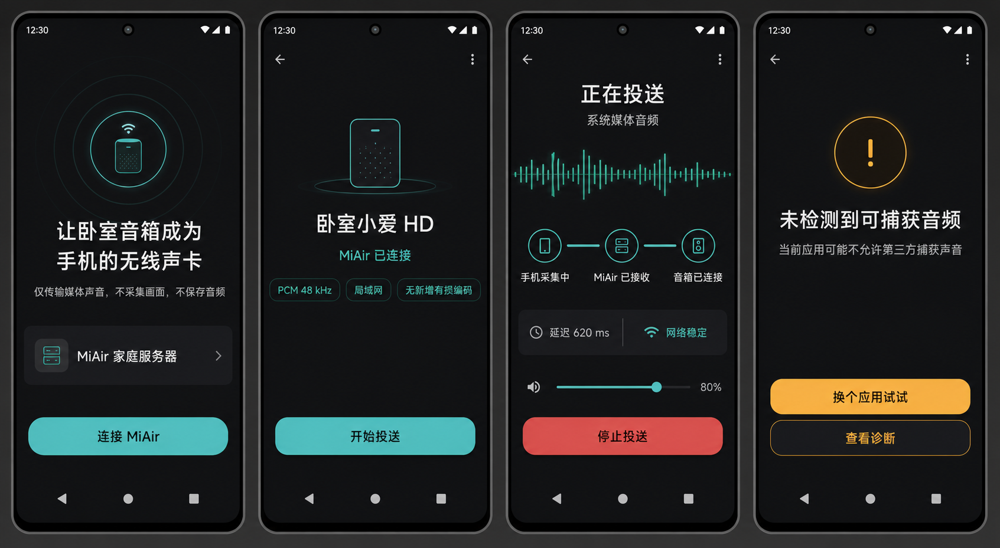

# MiAir Cast：Android 实时 PCM 投送设计

日期：2026-08-25  
状态：产品与技术设计基线，待 MVP 实现验证  
工作名称：MiAir Cast

## 1. 产品判断

首版选择 Android `AudioPlaybackCapture`，把 K60 的媒体混音以
PCM 16-bit/48 kHz/双声道发送给 MiAir，再复用 MiAir 已有的实时 WAV
输出和 M01 `play_by_url` 能力。

这条路线的目标不是取代 DLNA。两条入口分别解决不同问题：

- DLNA/URL 投送：音质优先，保留原始 FLAC/WAV/压缩文件，适合音乐。
- MiAir Cast：便利优先，覆盖允许捕获的系统媒体声音，适合视频、播客、网页和不便提供 URL 的 App。

首版不模拟系统声卡，不承诺 DRM、通话、闹钟或禁止第三方捕获的 App，
也不承诺视频级口型同步。首先验证 M01 对无限实时 WAV 流的启动延迟、
持续稳定性和恢复能力。

## 2. 目标用户与核心任务

目标用户是同一家庭局域网内的一名设备所有者。用户已经运行 MiAir，
希望在 K60 上播放任意常见媒体时，用最少步骤让卧室小爱音箱 HD 发声。

核心任务：

1. 首次安装后找到 MiAir 和“卧室小爱 HD”。
2. 明白系统授权虽然使用 MediaProjection，但 App 只读取音频 PCM，不读取或编码屏幕画面。
3. 一次点击、一次系统确认后开始投送。
4. 投送期间清楚看到真实状态，而不是只看到“服务已就绪”。
5. 能调节音箱音量、停止投送，并在无声、网络断开或 App 禁止捕获时得到可行动的解释。

## 3. MVP 范围

### 包含

- Android 10（API 29）及以上。
- 同一局域网内发现 MiAir。
- 一次性配对并持久保存服务端身份和访问令牌。
- `USAGE_MEDIA`、`USAGE_GAME`、`USAGE_UNKNOWN` 的 PCM 捕获。
- PCM 16-bit little-endian、48 kHz、双声道实时上传。
- 单台音箱、单个活跃会话。
- 前台服务和常驻通知。
- 音箱音量、停止投送、基础诊断。
- 网络中断和 MediaProjection 被撤销后的明确恢复流程。
- 日志和指标中不保存原始 PCM。

### 不包含

- DRM 或明确禁止捕获的 App 绕过。
- 通话、语音通信、闹钟、通知和麦克风。
- 多房间、严格同步、左右声道编组。
- 音乐标题和封面读取；首版不请求通知读取权限。
- 后台静默重新申请 MediaProjection。
- USB UAC 网桥、Root、Audio HAL 或妙播接收器。
- 云账号、远程公网投送。

## 4. 关键用户旅程

### 4.1 首次使用

1. 欢迎页解释“只传声音，不录屏、不保存音频”。
2. App 通过 mDNS/局域网发现 MiAir；无法发现时允许输入地址。
3. 用户选择 MiAir，输入 Web UI 显示的一次性配对码或扫描二维码。
4. App 显示唯一目标“卧室小爱 HD”和能力：PCM 48 kHz、单音箱。
5. 进入首页，不立即弹系统捕获授权。

### 4.2 开始投送

1. 用户点击“开始投送”。
2. 预授权页再次说明边界，并调用系统 MediaProjection 授权。
3. 授权成功后建立服务端会话；服务端准备 WAV URL，并让 M01 开始拉流。
4. 音箱 HTTP 客户端真正连接后，界面由“正在连接音箱”转为“正在投送”。
5. 前 1 秒使用小型环形缓冲避免握手期间丢失开头。

### 4.3 投送中

- 主状态显示“正在投送”，并展示真实的采集电平、上传速率、网络状态和音箱连接状态。
- 用户继续在原音乐/视频 App 中控制播放。
- MiAir Cast 只提供音箱音量和“停止投送”，不伪造源 App 的播放/暂停。
- 通知栏提供“停止”操作；快捷设置磁贴首版可停止，开始时仍进入授权页。

### 4.4 无声与故障

- 捕获电平持续为零：显示“未检测到可捕获音频”，解释目标 App 可能禁止捕获。
- 有 PCM、无上传：显示局域网连接错误并自动短时重连。
- 有上传、音箱未拉流：显示“音箱未开始接收”，提供重试和诊断。
- MediaProjection 被撤销：立即停止采集和会话，回到首页，不循环弹权限。
- M01 被语音或其他播放打断：首版停止并说明被其他播放接管，不做无限自动抢占。

## 5. 信息架构与页面

### 欢迎/配对

- 标题：“让卧室音箱成为手机的无线声卡”
- 隐私说明：“仅传输媒体声音，不采集画面，不保存音频”
- 自动发现的 MiAir 服务卡片
- 主按钮：“连接 MiAir”
- 次要入口：“手动输入地址”

### 首页/待机

- 设备卡：“卧室小爱 HD”
- 状态：“MiAir 已连接”
- 能力标签：“PCM 48 kHz”“局域网”“无新增有损编码”
- 主按钮：“开始投送”
- 最近一次结果和诊断入口

### 投送中

- 大型状态和实时电平波形
- 来源：“系统媒体音频”
- 三段状态：手机采集中 / MiAir 已接收 / 音箱已连接
- 音箱音量滑杆
- 延迟估计、网络状态、会话时长
- 强主操作：“停止投送”

### 受限/故障

- 不以泛化的“服务已就绪”掩盖真实问题。
- 根据流水线阶段给出具体原因和下一步。
- 保留“换个 App 试试”“重新连接”“查看诊断”三个动作中的相关项。

## 6. 高层架构

```text
┌──────────────────────── Redmi K60 ────────────────────────┐
│ Media App -> AudioFlinger -> AudioPlaybackCapture         │
│                       -> AudioRecord PCM                   │
│                       -> 20 ms 帧/环形缓冲                 │
│                       -> WebSocket PCM Client              │
└──────────────────────────────┬─────────────────────────────┘
                               │ LAN, token, sequence/timestamp
                               ▼
┌────────────────────────── MiAir ───────────────────────────┐
│ Pairing/API -> PCM Session Manager -> jitter buffer        │
│                              -> live WAV HTTP stream       │
│ SpeakerController -> MiNA play_by_url                      │
└──────────────────────────────┬─────────────────────────────┘
                               │ M01 pulls PCM/WAV over HTTP
                               ▼
                       卧室小爱音箱 HD
```

控制面和音频面分离：REST/WebSocket 控制会话，WebSocket 承载手机 PCM，
M01 继续通过现有 HTTP WAV 流获取音频。

## 7. Android 实现

### 技术选择

- Kotlin + Jetpack Compose + Material 3。
- `MediaProjectionManager` 获取一次性会话授权。
- `AudioPlaybackCaptureConfiguration` 只匹配 MEDIA/GAME/UNKNOWN。
- `AudioRecord` 请求 PCM 16-bit、48 kHz、双声道。
- Coroutine + 专用高优先级采集线程；使用预分配 `ByteBuffer`。
- OkHttp WebSocket 发送二进制帧。
- Foreground Service 保持会话；通知提供停止操作。
- DataStore 保存非秘密设置，Android Keystore 保护配对令牌。

### 帧格式

首版使用简单版本化二进制头，不引入 Protobuf：

```text
magic        4 bytes  "MIAP"
version      u8       1
flags        u8       start/eos/discontinuity/silence
header_len   u16
session_id   u64
sequence     u32
timestamp_us u64      Android monotonic clock
frames       u16      通常 960（20 ms @ 48 kHz）
channels     u8       2
format       u8       1 = PCM_S16LE
payload      3840 bytes for 20 ms stereo
```

WebSocket/TCP 在家庭局域网足够稳定。QUIC 和无损压缩会增加实现和诊断成本，
不进入 MVP。若客户端因背压落后，丢弃最旧音频并设置 discontinuity，优先保持
“实时”而不是数秒后继续播放旧声音。

## 8. MiAir 实现

新增建议模块：

```text
miair/pcm/
  protocol.py       帧解析、版本与校验
  session.py        单会话状态机、指标和超时
  jitter_buffer.py  时间戳排序、背压和静音填充
  api.py            配对、会话和 WebSocket 路由
```

复用 `miair/airplay/audio_stream.py` 的 WAV 流思想，但提取为通用
`LivePcmStream`，避免 Android 和 AirPlay 各维护一份无限 WAV HTTP 服务。

会话状态机：

```text
IDLE -> AUTHORIZED -> RECEIVING_PCM -> STARTING_SPEAKER
     -> SPEAKER_CONNECTED -> STREAMING
     -> DRAINING/FAILED -> STOPPED
```

只有在 M01 发起 HTTP GET 后才能向客户端报告 `speaker_connected=true`。
MiNA `play_by_url` 返回成功只代表控制命令已下发，不能当作实体音箱已经播放。

## 9. 安全与隐私

- 首次配对由 MiAir Web UI 生成短时一次性代码，交换高熵长期令牌。
- 令牌限定为局域网 PCM 投送权限，不能读取或修改小米账号凭据。
- 每个会话使用 nonce，拒绝重放和并发第二会话。
- 首版可在可信 LAN 使用 token + WebSocket；正式版优先使用 TLS 或二维码证书固定。
- 服务端和客户端默认不持久化 PCM，不把 payload 写入日志、崩溃报告或诊断包。
- UI 始终显示前台投送状态，用户可从系统通知立即停止。

## 10. 非功能目标

这些是 MVP 验收目标，不是未经测量的承诺：

| 指标 | 目标 |
|---|---|
| 点击开始到音箱可听 | p50 < 2.5 s，p95 < 5 s |
| 手机到 MiAir 传输/缓冲延迟 | p95 < 300 ms |
| 连续播放 | 稳定 Wi-Fi 下 30 分钟无可闻断裂 |
| 服务端抖动缓冲 | 默认 120 ms，可在 80–500 ms 调整 |
| Android 内存 | 稳态 < 64 MB |
| Android CPU | K60 稳态平均 < 5% |
| PCM 上传 | 约 192 KB/s，不落盘 |
| 故障可见性 | 5 秒内区分无 PCM、无网络、无音箱拉流 |
| 隐私 | 退出会话后无音频文件残留 |

M01 固件缓冲可能使端到端延迟超过上述传输目标。必须单独记录
`capture -> MiAir` 和 `MiAir -> audible`，不能用一个模糊的“延迟”指标掩盖。

## 11. 失败模式与处理

| 故障 | 用户看到 | 系统行为 |
|---|---|---|
| 目标 App 禁止捕获 | 未检测到可捕获音频 | 继续会话但提示换 App，避免无限重启 |
| MediaProjection 撤销 | 投送已由系统停止 | 立即释放 AudioRecord 和令牌 |
| Wi-Fi 切换/断开 | 与 MiAir 的连接中断 | 5 秒内有限重连，超时后停止 |
| WebSocket 背压 | 网络不稳定 | 丢弃旧帧，标记 discontinuity |
| MiNA 接受但 M01 未拉流 | 音箱未开始接收 | 不报告“正在投送”，允许一次显式重试 |
| 音箱 HTTP 断开 | 音箱连接中断 | 停止或有限重建新 URL，禁止无限抢占 |
| 第二手机投送 | 音箱正在被占用 | 拒绝第二会话，不静默覆盖 |
| App 被电池策略杀死 | 投送意外结束 | 前台服务、通知和省电设置指引 |

## 12. 测试与验收

### Android

- 帧编码、序号、时间戳和背压单元测试。
- MediaProjection 拒绝、撤销和重复会话测试。
- 熄屏、前后台、来电、Wi-Fi 切换和省电模式测试。
- 可捕获 App、禁止捕获 App、静音和高动态音乐样本测试。

### MiAir

- 帧解析、非法长度、版本拒绝和 token 权限测试。
- 抖动、延迟、乱序、断流、EOS 和第二会话测试。
- 假音箱 HTTP 客户端验证 WAV header、连续 PCM 和中断处理。
- 确认日志、异常和诊断包不包含 PCM payload。

### M01 真机

1. 5 分钟正弦/扫频确认声道、采样率和无周期爆音。
2. 30 分钟音乐稳定性测试。
3. 视频测量捕获事件到可听声音的端到端延迟。
4. 暂停、继续、熄屏、切 Wi-Fi、语音打断和拔网恢复。
5. 与同一音量下的 DLNA FLAC 做电平匹配听感比较。

## 13. 分阶段交付

### Phase 0：技术探针

- Android 最小采集器发送 PCM。
- MiAir 接收并保存短时内存统计，不落盘。
- M01 播放无限 WAV；测量真实启动与持续稳定性。

### Phase 1：单用户 MVP

- 完成配对、发现、前台服务、状态页、音量和停止。
- 完成结构化指标和明确错误状态。
- 通过 30 分钟真机验证。

### Phase 2：体验增强

- 快捷设置磁贴、设备记忆、网络自动恢复。
- 延迟自适应、诊断导出和更完善的电池策略提示。

### Phase 3：第二输入端

- 在相同 PCM Session 协议上增加 USB UAC Wi-Fi 网桥。
- 不改变 MiAir 后端和 M01 输出链路。

## 14. 原型视觉方向

- Android Material 3，高对比深色主题。
- 墨黑/深灰背景，青绿色表示 PCM 数据流和健康连接。
- 状态先于装饰；每个页面只有一个主操作。
- 不展示未经验证的歌曲封面和标题，首版统一称“系统媒体音频”。
- 原型总览图保存于 `docs/product/mi-air-cast-prototype.png`。


